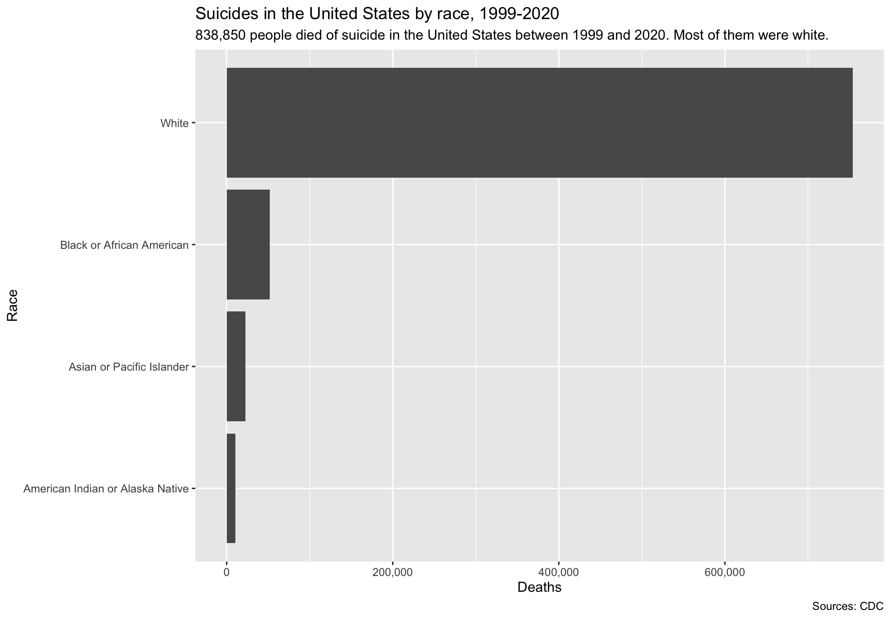
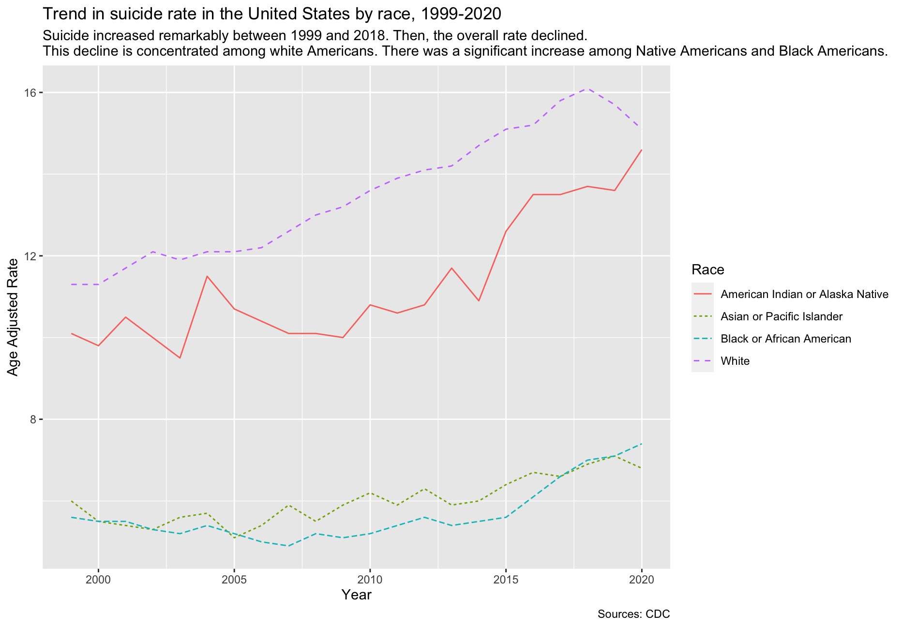

# Data on suicide trends in the United States by race

This repo includes data on suicide trends in the United States by race. I used this data to create a dashboard ([available at this link](https://datastudio.google.com/reporting/b97f968e-19de-47f0-9216-7cb088bf3f5c)). 
- `suicide by race, 1999-2020 - by year.csv`: trend by year
- `suicide by race, 1999-2020 - total.csv`: total over the time period
- `suicide_US_by_race.R`: an R script that recreates the plots in R
- `plot_total.png`: Suicides in the United States by race, 1999-2020 (see below)
- `plot_rate.png`: Suicide rate in the United States by race, 1999-2020 (see below)
- `plot_trend.png`: Trend in suicide rate in the United States by race, 1999-2020 (see below) 

